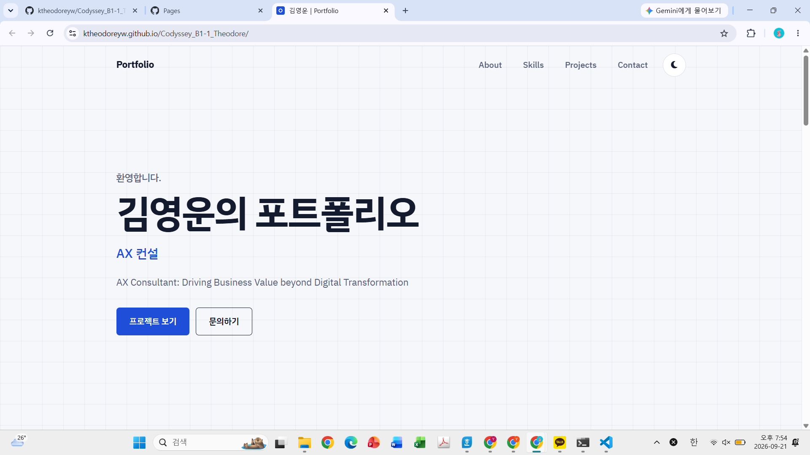
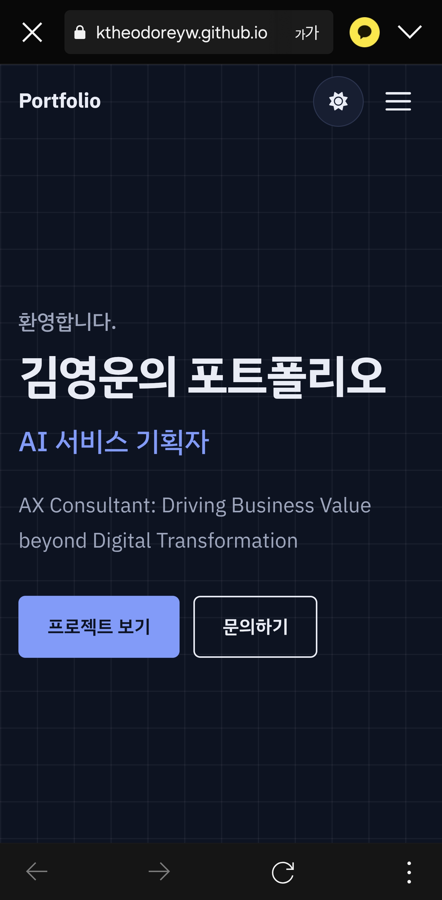
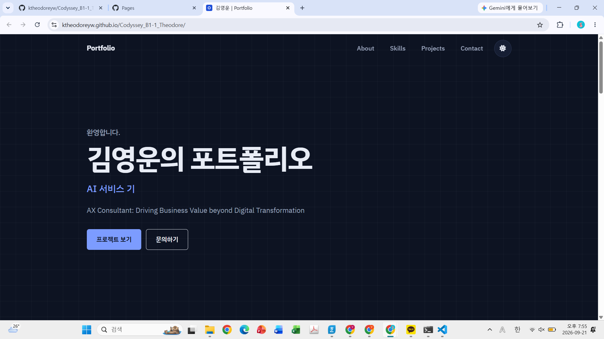

# 프로젝트 개요

외부 라이브러리 없이 **HTML / CSS / JavaScript** 만으로 반응형 포트폴리오 웹사이트 구현
GitHub API로 저장소 목록을 불러와 Projects 섹션에 렌더링하며, 모든 기능을 **"이벤트 → 상태 변경 → 화면 업데이트"** 흐름으로 구현

| 항목 | 내용 |
| --- | --- |
| 배포 URL | `https://ktheodoreyw.github.io/Codyssey_B1-1_Theodore/` |
| 저장소 URL | `https://github.com/<ktheodoreyw>/<Codyssey_B1-1_Theodore>` |
| 사용 기술 | HTML5, CSS3(Flexbox, Grid), JavaScript(ES6+), GitHub REST API |
| 허용된 외부 리소스 | Google Fonts(IBM Plex Sans KR), Font Awesome(아이콘) |
| 동작 확인 브라우저 | Chrome |

## 목차

1. [스크린샷](#1-스크린샷)
2. [포트폴리오 상세내용](#2-포트폴리오--상세내용)
3. [폴더 구조](#3-폴더-구조)
4. [실행, 업로드, 배포](#4-실행--업로드--배포)
5. [기준값 명시](#5-기준값-명시)
6. **기본 과제**
   - [6-1. 기능 요구사항 체크리스트](#6-1-기능-요구사항-체크리스트)
   - [6-2. 상태 → 렌더링 흐름 4가지](#6-2-상태--렌더링-흐름-4가지)
   - [6-3. 상태별 UI 확인 방법](#6-3-상태별-ui-확인-방법)
7. **평가표 항목별 설명**
   - [항목 1 — 동작 확인](#항목-1--동작-확인)
   - [항목 2 — 구조와 설계 이유](#항목-2--구조와-설계-이유)
   - [항목 3 — 코드 흐름 설명](#항목-3--코드-흐름-설명)
   - [항목 4 — 심화 질문](#항목-4--심화-질문)
8. [보너스 과제](#8-보너스-과제)
---

## 1. 스크린샷

> TODO: 배포 후 캡처한 이미지를 `images/screenshots/` 폴더에 아래 파일명으로 저장하면 자동으로 표시됩니다.

| 데스크톱 | 모바일 | 다크 모드 |
| --- | --- | --- |
|  |  |  |

---

## 2. 포트폴리오 상세내용

사이트에 표시되는 **내용(데이터)** 과 **구조·로직** 을 분리했습니다.
`index.html` 은 뼈대만 갖고 있고, `main.js` 의 `renderContent()` 가 `config.js` 의 값을 읽어 각 섹션에 채워 넣습니다.
따라서 **`js/config.js` 에서 `TODO` 로 표시된 값만 바꾸면** 전체 사이트에 반영됩니다.

| 섹션 | `config.js` 의 키 | 채울 내용 |
| --- | --- | --- |
| 탭 제목/설명 | `meta` | `title`, `description` |
| 네비게이션 | `nav` | `logoText` |
| Hero | `hero` | `greeting`, `title`, `role`, `typingPhrases`(보너스), `description`, CTA 버튼 문구/링크 |
| About | `about` | `lead`, `image.src`, `image.alt`, `paragraphs[]`, `facts[]` |
| Skills | `skills` | `lead`, `categories[]` — `{ category, items[] }` 1개가 카드 1개 |
| Projects | `projects` | **`githubUsername`(필수 교체)**, `excludeForks`, `maxRepos`, `sort` |
| Contact | `contact` | `lead`, `successMessage`, `formspreeEndpoint`(보너스) |
| Footer | `footer` | `copyrightName`, `socialLinks[]` — `{ label, url, iconClass }` |
| 보너스 ON/OFF | `features` | `languageFilter`, `typingEffect`, `systemTheme` |

- 프로필 사진: `images/` 폴더에 파일을 넣고 `about.image.src` 경로와 `alt` 문구를 수정합니다.
- 저작권 연도는 `new Date().getFullYear()` 로 자동 표시됩니다.
- ⚠️ `projects.githubUsername` 의 초기값 `octocat` 은 동작 확인용 샘플 계정입니다. 반드시 본인 아이디로 바꿔 주세요.

---

## 3. 폴더 구조

```text
portfolio/
├── index.html              # 메인 페이지 — 시맨틱 구조(뼈대)
├── css/
│   └── style.css           # 외부 스타일시트 — CSS 변수, 레이아웃, 반응형, 다크 모드
├── js/
│   ├── config.js           # 내용(데이터) — 이 파일만 수정하면 사이트 내용이 바뀜
│   └── main.js             # 로직 — 상태(state), 이벤트, 렌더링, API 호출
├── images/
│   ├── profile.svg         # 프로필 이미지 자리표시자 (본인 사진으로 교체)
│   ├── favicon.svg
│   └── screenshots/        # README 용 스크린샷 (desktop.png / mobile.png / dark.png)
├── .vscode/
│   ├── settings.json       # Live Server 포트 등 개발 환경 설정
│   └── extensions.json     # 권장 확장(Live Server)
├── .gitignore
└── README.md
```

---

## 4. 실행 · 업로드 · 배포

### 4-1. 로컬 실행 (VS Code + Live Server)

1. VS Code 에서 이 폴더를 엽니다. (`.vscode/extensions.json` 덕분에 Live Server 설치 권장 알림이 뜹니다)
2. `index.html` 우클릭 → **Open with Live Server** (`http://127.0.0.1:5500`)
3. 파일을 저장하면 브라우저가 자동으로 새로고침됩니다.

### 4-2. GitHub 업로드

```bash
cd portfolio
git init
git add .
git commit -m "feat: 반응형 포트폴리오 웹사이트 초기 구성"
git branch -M main
git remote add origin https://github.com/<GITHUB_ID>/<REPO_NAME>.git
git push -u origin main
```

### 4-3. GitHub Pages 배포

1. 저장소 → **Settings → Pages**
2. **Source**: `Deploy from a branch` / **Branch**: `main` · `/(root)` → **Save**
3. 1~2분 뒤 `https://<GITHUB_ID>.github.io/<REPO_NAME>/` 접속
4. 모든 파일 경로를 `css/style.css` 처럼 **상대 경로**로 작성했기 때문에, 하위 경로(`/<REPO_NAME>/`)에 배포되어도 그대로 동작합니다.

---

## 5. 기준값 명시

| 기능 | 기준값 | 코드 위치 (`js/main.js`) |
| --- | --- | --- |
| 네비게이션 배경색 변경 | 스크롤 **60px** 이상 | `NAV_SCROLL_THRESHOLD = 60` |
| 스크롤 탑 버튼 표시 | 스크롤 **300px** 이상 | `TOP_BUTTON_THRESHOLD = 300` |
| 스크롤 애니메이션 임계값 | threshold **0.2** (요소의 20% 가 보이면 등장) | `REVEAL_THRESHOLD = 0.2` |
| 반응형 브레이크포인트 | **768px**(태블릿), **1024px**(데스크톱) | `css/style.css` 13, 14번 구역 |
| 다크 모드 저장 키 | `localStorage['portfolio-theme']` | `THEME_STORAGE_KEY` |

> 스크롤 애니메이션은 섹션 전체가 아니라 **섹션 제목 · 본문 블록 · 카드 단위**로 관찰합니다. 모바일에서 Projects 섹션처럼 화면보다 5배 이상 긴 요소는 20% 가 한 화면에 들어올 수 없어 영원히 나타나지 않는 문제가 생기기 때문입니다.

---

# 기본 과제

## 6-1. 기능 요구사항 체크리스트

### 프로젝트 기본 구성

| 요구사항 | 구현 |
| --- | --- |
| `index.html`, `css/`, `js/`, `images/` 역할 분리 | [3. 폴더 구조](#3-폴더-구조) |
| 외부 CSS / JS 연결 | `<link rel="stylesheet" href="css/style.css">`, `<script src="js/*.js" defer>` |
| VS Code + Live Server | `.vscode/settings.json`, `.vscode/extensions.json` |

### HTML 구조 (시맨틱 마크업)

| 요구사항 | 구현 (`index.html`) |
| --- | --- |
| 시맨틱 태그 | `<header>` `<nav>` `<main>` `<section>` `<article>` `<footer>` + `<figure>` `<dl>` `<time>` |
| 6개 섹션 | `#hero` `#about` `#skills` `#projects` `#contact` + `<footer>` |
| 앵커 링크 | `<nav>` 안의 `href="#about"` … `href="#contact"`, 로고는 `#hero` |
| 이미지 `alt` | 프로필 이미지 1장 — `config.about.image.alt` 값이 주입됨. 아이콘은 장식이므로 `aria-hidden="true"` |
| `<label>` 연결 | `for="name"`↔`id="name"`, `for="email"`↔`id="email"`, `for="message"`↔`id="message"` |

### CSS (레이아웃 & 반응형)

| 요구사항 | 구현 (`css/style.css`) |
| --- | --- |
| CSS 변수 `:root` | 1번 구역 — 색상(`--color-*`), 폰트(`--font-*`), 간격(`--space-*`), 그림자·전환 |
| 다크 모드 변수 | 2번 구역 — `[data-theme='dark']` 에서 같은 이름의 변수 값만 교체 |
| 네비게이션 Flexbox | `.nav { display: flex }` + `.nav__logo { margin-right: auto }` → 로고 왼쪽, 메뉴 오른쪽 |
| Projects Grid | `.projects-grid { grid-template-columns: repeat(auto-fit, minmax(min(100%, 280px), 1fr)) }` |
| 모바일 퍼스트 | 기본 스타일 = 모바일, `@media (min-width: 768px)`, `@media (min-width: 1024px)` 로 확장 |
| 모바일 햄버거 | 기본: `.nav__menu` 숨김 + `.hamburger` 표시 / 768px~: 반대 |
| hover + transition | `.btn:hover`, `.card:hover`, `.icon-btn:hover`, `.filter-btn:hover` 등 |
| `box-shadow` | `.card { box-shadow: var(--shadow-card) }` → hover 시 `--shadow-card-hover` |
| 인라인 스타일 금지 | HTML · JS 템플릿 어디에도 `style="..."` 없음 (모든 시각 변화는 클래스 토글) |

### JavaScript (DOM & 이벤트)

| 요구사항 | 구현 (`js/main.js`) |
| --- | --- |
| `defer` 연결 | `index.html` `<head>` 의 두 `<script ... defer>` |
| `const` / `let` 만 사용 | `var` 0건. `let` 은 값이 실제로 바뀌는 타이핑 효과의 인덱스에만 사용 |
| `addEventListener` | HTML 에 `onclick` 0건. `initTheme` `initNavigation` `initProjects` `initForm` 에서 연결 |
| `querySelector(All)` | 헬퍼 `$`, `$$` 와 `dom` 캐시 객체 |
| `textContent` / `innerHTML` | `setText()`, `renderContent()`, `renderProjects()`, `renderForm()` |
| `classList.add/remove/toggle` | `renderTheme()`(add·remove), `renderUI()`(toggle), 스크롤 애니메이션(add) |
| `click` | 테마 토글, 햄버거, 앵커 링크, 스크롤 탑, 재시도, 필터 |
| `submit` | `handleFormSubmit` |
| `scroll` | `handleScroll` (`{ passive: true }`) |
| `input` | `handleFormInput` |
| `event.preventDefault()` | `handleAnchorClick`(앵커 점프 방지), `handleFormSubmit`(새로고침 방지) |

### 인터랙션

| 기능 | 동작 | 구현 |
| --- | --- | --- |
| 햄버거 메뉴 | 클릭 → 메뉴 표시 / 다시 클릭 → 숨김. 메뉴 링크 클릭·`Esc` 로도 닫힘 | `handleHamburgerClick` → `renderUI()` 의 `classList.toggle('active', menuOpen)` |
| 부드러운 스크롤 | 메뉴·CTA 클릭 시 해당 섹션으로 부드럽게 이동 | `handleAnchorClick` 의 `scrollIntoView({ behavior: 'smooth' })` + CSS `scroll-padding-top` |
| 스크롤 탑 버튼 | 300px 이상에서 표시, 클릭 시 맨 위로 | `handleScroll`, `handleScrollTopClick` |
| 네비 스타일 변경 | 60px 이상에서 `.scrolled` → 배경색·경계선 | `handleScroll` → `renderUI()` |
| 다크 모드 | 토글 + `localStorage` 저장 → 새로고침 후 유지 | `handleThemeToggle`, `initTheme`, `renderTheme` |
| 스크롤 애니메이션 | `.reveal` 요소가 20% 보이면 `.visible` 추가 | `revealObserver`, `observeReveals` |
| 폼 UX | 필수값·이메일 형식 검증, 필드 바로 아래 에러 표시, 성공 메시지 | `validators`, `handleFormInput`, `handleFormSubmit`, `renderForm` |

### ES6+ 문법 & 배열 메서드

| 문법 | 사용 예 |
| --- | --- |
| 화살표 함수 | 파일 전체 (`const setState = (slice, patch) => { … }`) |
| 템플릿 리터럴 | `createRepoCard`, `projectViews`, `renderContent`, API 엔드포인트 문자열 |
| 구조분해 할당 | `const { meta, nav, hero, … } = SITE_CONFIG`, `createRepoCard` 의 `html_url: url`, `([field, message]) =>` |
| `map` | 저장소 배열 → 카드 HTML, 스킬 → `<article>`, 소셜 링크 → `<li>` |
| `filter` | `fetchRepos` 에서 fork 저장소 제외 (`excludeForks`) |
| `forEach` | 앵커 링크 이벤트 연결, Observer 엔트리 순회, 폼 에러 렌더링 |
| 그 외 | 스프레드(`{ ...state[slice], ...patch }`), `??`, `find`, `Object.entries / fromEntries` |

### 비동기 처리 & API 연동

| 상태 | UI | 구현 |
| --- | --- | --- |
| 로딩 | 스피너 + "프로젝트를 불러오는 중..." | `projectViews.loading` |
| 성공 | 카드 Grid | `projectViews.success` |
| 에러 | "프로젝트를 불러올 수 없습니다" + 원인 안내 + **[다시 시도]** | `projectViews.error` |
| 빈 상태 | "표시할 프로젝트가 없습니다" | `projectViews.empty` |

- 엔드포인트: `https://api.github.com/users/{githubUsername}/repos?sort=updated&per_page=100`
- `fetch` + `async/await` + `try/catch` — `requestRepos()`, `fetchRepos()`
- **레이트 리밋(403/429)**: `getHttpErrorMessage()` 가 "요청 한도 초과" 문구와 `x-ratelimit-reset` 헤더 기준 재시도 가능 시각을 에러 UI 에 표시합니다.
- GitHub 응답 값은 `escapeHTML()` 을 거쳐 `innerHTML` 에 들어갑니다. (저장소 설명에 `<script>` 같은 문자열이 있어도 실행되지 않음)

## 6-2. 상태 → 렌더링 흐름 4가지

모든 상태는 `state` 객체 하나에 모여 있고, **`setState(slice, patch)` 만이 상태를 바꿀 수 있습니다.** `setState` 는 상태를 바꾼 직후 그 조각을 담당하는 render 함수를 호출합니다.

```js
const setState = (slice, patch) => {
  state[slice] = { ...state[slice], ...patch }; // 1) 상태 변경
  renderers[slice]();                           // 2) 화면 업데이트
};
```

| # | 사용자 이벤트 | 상태 변경 | 화면 업데이트 |
| --- | --- | --- | --- |
| ① | 테마 버튼 `click` | `state.theme.mode` | `renderTheme()` → `<html data-theme>` 변경 → CSS 변수 교체 |
| ② | 햄버거 `click` / `scroll` | `state.ui.menuOpen` · `navScrolled` · `showTopButton` | `renderUI()` → `.active` `.scrolled` `.show` 클래스 토글 |
| ③ | 페이지 진입 / 재시도 `click` | `state.projects.status` · `items` · `errorMessage` | `renderProjects()` → 로딩/성공/에러/빈 화면 |
| ④ | 폼 `input` / `submit` | `state.form.values` · `errors` · `status` | `renderForm()` → 에러 메시지·성공 메시지 |

## 6-3. 상태별 UI 확인 방법

실제 API 상태는 마음대로 만들기 어려워서, 주소 뒤에 쿼리를 붙이면 해당 상태를 재현하도록 했습니다. (`requestRepos()` 의 `getMockMode()`)

| 주소 | 재현되는 상태 |
| --- | --- |
| `index.html` | 실제 API 호출 (로딩 → 성공) |
| `index.html?mock=loading` | 로딩 상태 유지 (스크린샷용) |
| `index.html?mock=error` | 0.8초 로딩 후 에러 상태 + 재시도 버튼 |
| `index.html?mock=empty` | 0.8초 로딩 후 빈 상태 |

실제 에러도 확인할 수 있습니다: Chrome 개발자 도구 → Network → **Offline** 체크 후 새로고침(네트워크 에러), 또는 `config.js` 의 `githubUsername` 을 존재하지 않는 아이디로 변경(404).

---

# 평가표 항목별 설명

## 항목 1 — 동작 확인

### 1-1. 브라우저 창 크기를 줄였을 때 레이아웃이 모바일에 맞게 변경되는가?

| 화면 폭 | 네비게이션 | About | Skills / Projects | Footer |
| --- | --- | --- | --- | --- |
| ~767px (모바일) | 햄버거 버튼 + 드롭다운 메뉴 | 1열 (사진 위, 글 아래) | 1열 | 세로 정렬, 가운데 |
| 768px~ (태블릿) | 가로 메뉴, 햄버거 숨김 | 2열 (240px + 나머지) | 2~3열 자동 | 가로 정렬, 양끝 |
| 1024px~ (데스크톱) | 메뉴 간격 확대 | 2열 (300px + 나머지) | 3열 | 〃 |

- **확인 방법**: Chrome 개발자 도구(F12) → 기기 툴바(Ctrl+Shift+M) 에서 폭을 375 / 800 / 1280px 로 바꿔 봅니다.
- 카드 Grid 는 `auto-fit + minmax` 로 **미디어 쿼리 없이** 열 개수가 바뀝니다. 제목 크기는 `clamp()` 로 화면 폭에 비례합니다.

### 1-2. 테마 토글 시 다크/라이트가 전환되고, 새로고침 후에도 유지되는가?

1. 우측 상단 달/해 버튼 클릭 → 즉시 전환
2. 개발자 도구 → Application → Local Storage 에서 `portfolio-theme: "dark"` 확인
3. 새로고침 → `initTheme()` 이 `readSavedTheme()` 로 저장값을 읽어 같은 테마로 시작

### 1-3. 햄버거 메뉴, 스크롤 애니메이션, 맨 위로 가기 버튼 등이 정상 동작하는가?

| 기능 | 확인 방법 |
| --- | --- |
| 햄버거 메뉴 | 폭 767px 이하 → 버튼 클릭 시 메뉴 표시(아이콘이 X 로 변함) → 다시 클릭 시 숨김 |
| 부드러운 스크롤 | 메뉴의 `Projects` 클릭 → 부드럽게 이동, 고정 헤더에 제목이 가려지지 않음 |
| 네비 스타일 | 60px 이상 스크롤 → 헤더에 반투명 배경 + 하단 경계선 |
| 스크롤 탑 버튼 | 300px 이상 스크롤 → 우측 하단 버튼 등장 → 클릭 시 맨 위로 |
| 스크롤 애니메이션 | 스크롤하면 각 블록·카드가 아래에서 위로 떠오르며 등장 |

### 1-4. GitHub API 데이터가 표시되고, 로딩/에러/빈 상태가 구분되는가?

[6-3. 상태별 UI 확인 방법](#6-3-상태별-ui-확인-방법) 의 주소로 네 가지 상태를 각각 시연할 수 있습니다.

### 1-5. 필수 입력값 누락, 이메일 형식 오류 시 즉각적인 피드백이 표시되는가?

| 시나리오 | 결과 |
| --- | --- |
| 아무것도 입력하지 않고 [메시지 보내기] | 세 필드 아래에 각각 에러 문구 + 빨간 테두리, 첫 번째 오류 필드로 포커스 이동 |
| 이메일에 `abc` 입력 | **타이핑하는 즉시** "이메일 형식이 올바르지 않습니다" 표시 |
| `abc@test.com` 으로 수정 | 즉시 에러 사라짐 |
| 모두 올바르게 입력 후 제출 | 페이지 새로고침 없이 성공 메시지 표시 + 폼 초기화 |

- 브라우저 기본 말풍선 대신 직접 만든 UI 를 쓰기 위해 `<form novalidate>` 를 지정했습니다.
- 에러 영역은 `min-height` 로 자리를 미리 확보해, 메시지가 나타나도 아래 요소가 밀리지 않습니다.

---

## 항목 2 — 구조와 설계 이유

### 2-1. HTML / CSS / JavaScript 를 파일로 분리한 이유와 각 파일의 역할

| 파일 | 역할 | 한 문장 요약 |
| --- | --- | --- |
| `index.html` | **구조** | 무엇이 있는가 (콘텐츠의 의미와 순서) |
| `css/style.css` | **표현** | 어떻게 보이는가 (색, 배치, 반응형, 애니메이션) |
| `js/config.js` | **데이터** | 무슨 내용인가 (이름, 소개, 스킬, 링크) |
| `js/main.js` | **동작** | 어떻게 반응하는가 (상태, 이벤트, 렌더링, API) |

**분리한 이유**

1. **관심사 분리** — 색을 바꾸려면 CSS 만, 문구를 바꾸려면 config 만 열면 됩니다. 수정 범위가 좁아져 실수가 줄어듭니다.
2. **재사용·캐싱** — 외부 파일은 브라우저가 캐시하므로, HTML 이 바뀌어도 CSS/JS 를 다시 내려받지 않습니다.
3. **가독성·협업** — 한 파일에 세 언어가 섞이면 어디서 무엇이 일어나는지 추적하기 어렵습니다. 인라인 `style`, `onclick` 을 쓰지 않은 것도 같은 이유입니다.
4. **JS 를 `config.js` / `main.js` 로 한 번 더 나눈 이유** — "자주 바뀌는 내용"과 "거의 안 바뀌는 로직"을 분리해, 내용 수정이 로직을 망가뜨릴 위험을 없앴습니다.

### 2-2. 시맨틱 태그 선택 기준

**기준: "이 영역의 역할을 한 단어로 말할 수 있으면 그 이름의 태그를, 스타일을 위한 묶음일 뿐이면 `div` 를 쓴다."**

| 태그 | 사용 위치 | 선택 기준 |
| --- | --- | --- |
| `<header>` | 사이트 상단 / 각 섹션의 제목 묶음 | 소개·탐색 역할을 하는 머리말 |
| `<nav>` | 메뉴 | 주요 탐색 링크 묶음. `aria-label` 로 이름 부여 |
| `<main>` | Hero ~ Contact | 페이지의 핵심 콘텐츠. 문서에 한 번만 사용 |
| `<section>` | Hero, About, Skills, Projects, Contact | **제목(h1/h2)을 가진 주제별 구역.** `aria-labelledby` 로 제목과 연결 |
| `<article>` | 스킬 카드, 프로젝트 카드 | **떼어 내도 그 자체로 의미가 완결되는 독립 콘텐츠** |
| `<footer>` | 저작권, 소셜 링크 | 페이지의 꼬리말 |
| `<figure>` `<dl>` `<time>` | 프로필 이미지 / 핵심 정보(라벨-값) / 업데이트 날짜 | 데이터의 의미를 그대로 표현 |
| `<div>` | `.container`, `.hero__cta` 등 | 의미 없이 레이아웃용으로만 묶을 때 |

**시맨틱 태그를 쓰는 이유** — ① 스크린 리더가 "탐색", "주요 콘텐츠" 같은 랜드마크로 바로 이동할 수 있고(접근성), ② 검색 엔진이 구조를 이해하며(SEO), ③ `div` 만 있을 때보다 코드만 봐도 구조가 읽힙니다(유지보수).
제목 계층도 `h1`(Hero, 1개) → `h2`(섹션 제목) → `h3`(카드 제목) 순서를 건너뛰지 않았습니다.

### 2-3. CSS 변수로 관리하는 이점

```css
:root               { --color-bg: #f6f7fb; --color-text: #151b2e; … }
[data-theme='dark'] { --color-bg: #0d1322; --color-text: #e8ecf5; … }
```

1. **다크 모드를 변수 교체만으로 구현** — 모든 컴포넌트는 `var(--color-bg)` 만 참조합니다. `<html data-theme="dark">` 가 되면 변수 값이 바뀌고 화면 전체가 따라옵니다. 변수가 없었다면 `.card`, `.btn`, `.nav` … 마다 다크용 규칙을 중복 작성해야 합니다.
2. **한 곳만 고치면 전체 반영** — 강조색을 바꾸려면 `--color-accent` 한 줄만 수정합니다. (버튼·링크·태그·포커스 링 등 약 20곳에 반영)
3. **일관성** — 간격을 `--space-1`~`--space-7` 단계로 제한해 `13px`, `17px` 같은 임의 값이 섞이지 않습니다.
4. **반응형에서 값만 재정의** — 태블릿에서 `--space-section`, `--header-height` 값만 바꾸면 이를 쓰는 모든 규칙(섹션 여백, 메뉴 위치, `scroll-padding-top`)이 함께 바뀝니다.
5. **Sass 변수와의 차이** — CSS 변수는 **브라우저에서 실행 중에 바뀔 수 있고** 상속됩니다. 그래서 JS 는 속성 하나(`data-theme`)만 바꾸면 됩니다.

### 2-4. `onclick` 인라인 속성 대신 `addEventListener` 를 쓴 이유

| 비교 | `onclick="..."` (인라인) | `addEventListener` |
| --- | --- | --- |
| 구조·동작 분리 | HTML 안에 JS 가 섞임 | HTML 은 구조만, JS 파일에서 연결 |
| 핸들러 개수 | 요소·이벤트당 **1개** (다시 지정하면 덮어씀) | **여러 개** 등록 가능 |
| 옵션 | 없음 | `{ passive, once, capture }` — 예: `scroll` 에 `passive: true` |
| 해제 | 속성을 지워야 함 | `removeEventListener` |
| 스코프 | 핸들러가 **전역 함수**여야 함 → 전역 오염 | 모듈 내부의 `const` 함수 사용 가능 |
| 동적 요소 | 요소를 만들 때마다 문자열로 넣어야 함 | **이벤트 위임**으로 부모에 한 번만 연결 |
| 보안 | CSP 에서 인라인 스크립트로 차단됨 | 영향 없음 |

**이 프로젝트에서의 실제 이점** — "다시 시도" 버튼과 필터 버튼은 `innerHTML` 로 매번 새로 그려집니다. 부모(`#projects-view`, `#project-filters`)에 리스너를 **한 번만** 걸고 `event.target.closest('[data-action="retry"]')` 로 판별하므로, 다시 그릴 때마다 이벤트를 재연결할 필요가 없습니다.

---

## 항목 3 — 코드 흐름 설명

### 3-1. "이벤트 → 상태 변경 → 화면 업데이트" 따라가기 (예: 다크 모드)

```text
[이벤트]      사용자가 #theme-toggle 클릭
                 │  initTheme(): dom.themeToggle.addEventListener('click', handleThemeToggle)
                 ▼
[핸들러]      handleThemeToggle()
                 │  nextMode = state.theme.mode === 'dark' ? 'light' : 'dark'
                 │  saveTheme(nextMode)                     → localStorage 저장
                 ▼
[상태 변경]   setState('theme', { mode: nextMode, source: 'user' })
                 │  state.theme = { ...state.theme, ...patch }
                 │  renderers.theme()
                 ▼
[화면 업데이트] renderTheme()
                 │  <html data-theme="dark">                → CSS 변수 교체 → 전체 색상 변경
                 │  aria-pressed / aria-label 갱신
                 │  아이콘 classList.remove('fa-moon') → add('fa-sun')
                 ▼
[새로고침]    initTheme() → readSavedTheme() === 'dark' → setState('theme', …) → 같은 renderTheme() 실행
```

핵심은 **핸들러가 DOM 을 직접 건드리지 않는다**는 점입니다. 핸들러는 상태만 바꾸고, 화면은 `renderTheme()` 만 그립니다. 그래서 "클릭으로 바뀐 경우"와 "새로고침으로 복원된 경우"가 **같은 렌더 함수**를 거쳐 결과가 항상 같습니다.

폼도 같은 구조입니다: `input` 이벤트 → `handleFormInput` → `setState('form', { values, errors })` → `renderForm()` 이 에러 문구·`.invalid` 클래스를 표시/숨김.

### 3-2. `async/await` + `try/catch` 로 성공과 실패를 분기한 방법

```js
const fetchRepos = async () => {
  setState('projects', { status: 'loading', errorMessage: '' });        // ① 요청 직전: 로딩

  try {
    const data = await requestRepos();                                  // ② 응답이 올 때까지 대기
    const items = data.filter(…).slice(0, projects.maxRepos);
    setState('projects', {
      status: items.length > 0 ? 'success' : 'empty',                   // ③ 성공 / 빈 상태
      items,
    });
  } catch (error) {                                                     // ④ 실패는 모두 여기로
    const errorMessage = error instanceof TypeError
      ? '네트워크 연결을 확인한 뒤 다시 시도해 주세요.'
      : error.message;
    setState('projects', { status: 'error', items: [], errorMessage });
  }
};
```

| 상황 | 흐름 | 최종 상태 |
| --- | --- | --- |
| 정상 응답 + 저장소 있음 | `try` 끝까지 진행 | `success` |
| 정상 응답 + 저장소 0개 | `items.length === 0` | `empty` |
| 네트워크 단절 | `fetch` 가 `TypeError` 로 reject → `catch` | `error` |
| 403(레이트 리밋) · 404 · 5xx | `requestRepos()` 의 `if (!response.ok) throw new Error(…)` → `catch` | `error` |

**가장 중요한 포인트** — `fetch` 는 **HTTP 404/403 을 에러로 취급하지 않습니다** (네트워크 자체가 실패했을 때만 reject). 그래서 `response.ok` 를 직접 확인해 `throw` 해야 실패가 `catch` 로 모입니다. 이렇게 하면 실패 경로가 하나로 합쳐져 에러 UI 처리가 한 곳에서 끝납니다.
`await` 는 Promise 가 끝날 때까지 **이 함수만** 멈추고 브라우저는 멈추지 않으므로, 기다리는 동안 ① 에서 그린 스피너가 보입니다. [다시 시도] 버튼은 같은 `fetchRepos()` 를 다시 호출할 뿐입니다.

### 3-3. 배열 메서드로 GitHub 데이터를 카드 UI 로 변환하는 과정

```text
[1] GitHub 응답        [{ name, description, html_url, fork, language, stargazers_count, … }, …]
       │
[2] filter             .filter(({ fork }) => !(projects.excludeForks && fork))   → fork 저장소 제외
       │
[3] slice              .slice(0, projects.maxRepos)                              → 최대 12개
       │
[4] 상태 저장          setState('projects', { status: 'success', items })
       │
[5] filter (보너스)    getVisibleRepos() — 선택한 언어의 저장소만
       │
[6] map                .map(createRepoCard)      → 객체 1개 → '<article class="card">…</article>' 문자열 1개
       │
[7] join               .join('')                 → 문자열 배열 → 하나의 HTML 문자열
       │
[8] DOM 반영           dom.projectsView.innerHTML = …
       │
[9] forEach            observeReveals() — 새 카드들을 순회하며 IntersectionObserver 등록
```

- `createRepoCard` 는 **구조분해 할당**으로 필요한 값만 꺼내며 읽기 좋은 이름으로 바꿉니다: `html_url: url`, `stargazers_count: stars`. 그리고 **템플릿 리터럴**로 HTML 을 만듭니다.
- `map` 은 "N개 → N개 변환", `filter` 는 "N개 → 조건에 맞는 M개", `forEach` 는 "반환값 없이 각 요소에 작업 수행"입니다. `for` 문과 달리 **원본 배열을 바꾸지 않고 새 배열을 반환**하므로 상태(`state.projects.items`)를 안전하게 보존한 채 화면용 데이터만 가공할 수 있습니다.

### 3-4. Flexbox 와 Grid 적용 위치와 선택 이유

| 구분 | Flexbox | Grid |
| --- | --- | --- |
| 차원 | **1차원** (한 줄: 가로 또는 세로) | **2차원** (행과 열 동시) |
| 크기 결정 | **내용물**이 크기를 결정 | **컨테이너(트랙)** 가 크기를 결정 |
| 적합한 상황 | 정렬, 양끝 배치, 크기가 제각각인 요소 나열 | 같은 크기의 칸이 반복되는 목록, 페이지 골격 |

| 적용 위치 | 방식 | 이유 |
| --- | --- | --- |
| 네비게이션 `.nav` | Flex | 로고·메뉴·버튼을 **한 줄**에 놓고 `margin-right: auto` 로 양끝 배치. 메뉴 항목 너비는 글자 수대로 |
| Hero CTA, 카드 메타, 태그 목록, 필터 버튼 | Flex + `wrap` | 너비가 제각각인 요소를 나열하다가 넘치면 자연스럽게 줄바꿈 |
| 프로젝트 카드 내부 `.project-card` | Flex(column) | 설명에 `flex: 1` → 설명 길이가 달라도 메타 정보가 카드 하단에 정렬 |
| Footer | Flex | 모바일 세로 → 태블릿부터 가로 양끝 배치 (`flex-direction` 만 변경) |
| **Projects 카드 목록** | **Grid** | 카드 개수가 API 에 따라 달라지고, **행·열이 모두 맞아야** 함. `repeat(auto-fit, minmax(280px, 1fr))` 한 줄로 열 개수가 1→2→3 자동 변경 |
| Skills 카드 목록 | Grid | 위와 동일 |
| About (사진 \| 글) | Grid | `240px 1fr` 처럼 **열 너비를 컨테이너에서 지정**하는 편이 명확 |

같은 카드 목록을 Flex 로 만들면 마지막 줄의 카드가 남는 공간을 채우며 늘어나 열이 어긋납니다. Grid 는 트랙을 먼저 정의하므로 마지막 줄에 카드가 2개뿐이어도 윗줄과 열이 맞습니다.

---

## 항목 4 — 심화 질문

### 4-1. 상태(STATE) 객체를 따로 만든 이유 — 그냥 변수로 처리하면 안 되는가?

동작은 합니다. 하지만 기능이 늘어날수록 아래 문제가 생깁니다.

| 문제 | 개별 변수 / DOM 에서 읽기 | `state` 객체 + `setState` |
| --- | --- | --- |
| **진실의 원천** | "메뉴가 열렸나?"를 `classList.contains('active')` 로 DOM 에 물어봄 → 화면이 곧 데이터가 되어, 클래스명·마크업이 바뀌면 로직이 깨짐 | 데이터는 `state` 에만 있고 DOM 은 그 **결과물** |
| **화면과의 동기화** | 변수만 바꾸고 화면 갱신을 깜빡하면 둘이 어긋남 | 상태 변경 통로가 `setState` 하나 → 바꾸면 **반드시** render 호출 |
| **불가능한 조합** | `isLoading`, `hasError`, `isEmpty` 를 따로 두면 `isLoading && hasError` 같은 모순 상태가 생김 | `status: 'loading' \| 'success' \| 'error' \| 'empty'` **하나의 값** → 항상 넷 중 하나 |
| **추적·디버깅** | 값이 어디서 바뀌는지 파일 전체를 찾아야 함 | `setState` 한 곳에 `console.log` 를 넣으면 모든 변경이 보임 |
| **파악 용이성** | 변수가 여기저기 흩어짐 | `state` 선언부만 읽으면 이 앱에서 "변할 수 있는 모든 것"을 알 수 있음 |
| **React 와의 연결** | — | `useState` + 리렌더링과 같은 모델. "UI = f(state)" |

**구체적인 예** — 필터(보너스)를 누르면 `state.projects.filter` 만 바뀝니다. 원본 `items` 는 그대로이고, `renderProjects()` 가 `items + filter` 로부터 보여 줄 목록을 **매번 계산**합니다. 만약 상태 없이 DOM 에서 카드를 직접 지우는 방식이었다면 "All" 로 돌아올 때 API 를 다시 호출해야 했을 것입니다.

> 참고: 타이핑 효과의 `charIndex` 같은 값은 그 함수 밖에서 아무도 쓰지 않고 다른 UI 에 영향을 주지 않으므로 `state` 에 넣지 않고 지역 `let` 으로 두었습니다. **"여러 곳의 화면을 결정하는 값"만 상태로 관리**한다는 기준입니다.

### 4-2. "모바일 퍼스트"로 작성한 이유

1. **추가하는 쪽이 덮어쓰는 쪽보다 단순합니다.** 모바일은 대부분 1열이라 기본 흐름(block) 그대로이고, 넓어질 때 `grid-template-columns` 등 **필요한 것만 추가**하면 됩니다. 데스크톱 퍼스트는 복잡한 다단 레이아웃을 먼저 만들고 모바일에서 하나씩 **취소(`float: none`, `width: auto` …)** 해야 해서 코드가 길어지고 우선순위 충돌이 잦습니다.
2. **성능이 약한 기기가 가장 적은 CSS 를 해석합니다.** 모바일은 미디어 쿼리 밖의 기본 스타일만 적용하고, `min-width` 블록은 건너뜁니다.
3. **콘텐츠 우선순위를 먼저 정하게 됩니다.** 좁은 화면에서는 "무엇이 가장 중요한가"를 먼저 결정해야 하고, 그 순서가 곧 HTML 의 순서가 됩니다. 넓은 화면은 그 위에 배치만 풍성하게 합니다.
4. **실제 사용 환경** — 웹 트래픽의 절반 이상이 모바일이고, 검색 엔진도 모바일 화면을 기준으로 페이지를 평가합니다(모바일 우선 색인).
5. **이 프로젝트에서의 결과** — 미디어 쿼리는 `min-width: 768px`, `min-width: 1024px` 두 개뿐이며, 그 안에는 "네비게이션 가로 전환", "About 2열", "Footer 가로 배치", "여백 변수 확대" 정도만 들어 있습니다. 카드 목록은 `auto-fit` 덕분에 미디어 쿼리가 아예 필요 없습니다.

---

# 8. 보너스 과제

> 보너스 코드는 세 파일 모두에서 **`[BONUS n]` … `[/BONUS n]` 주석 블록**으로 기본 과제 코드와 구분했습니다.
> `js/config.js` 의 `features` 값을 `false` 로 바꾸면 해당 보너스 없이 **기본 과제만** 동작합니다.

| # | 보너스 | ON/OFF | 코드 위치 (주석으로 검색) |
| --- | --- | --- | --- |
| 1 | 언어별 프로젝트 필터링 | `features.languageFilter` | `main.js` `[BONUS 1]` · `style.css` `[BONUS 1]` · `index.html` `#project-filters` |
| 2 | Hero 타이핑 효과 | `features.typingEffect` | `main.js` 11번 구역 `[BONUS 2]` · `style.css` `[BONUS 2]` · `index.html` `.hero__typing` |
| 3 | 폼 실제 전송 (Formspree) | `contact.formspreeEndpoint` 입력 시 | `main.js` `[BONUS 3]` `sendToFormspree()` |
| 4 | 시스템 다크 모드 감지 | `features.systemTheme` | `main.js` `[BONUS 4]` · `style.css` `[BONUS 4]` |

## BONUS 1: 언어별 프로젝트 필터링 (`array.filter`)

- `getLanguages()` : 저장소 배열을 `map` 으로 언어만 뽑고 `Set` 으로 중복 제거 → `['All', 'JavaScript', 'Python', …]` 버튼 생성. `language` 가 `null` 인 저장소는 "기타"로 묶습니다.
- `getVisibleRepos()` : `items.filter((repo) => getLanguageLabel(repo) === filter)`
- **상태 → 렌더링 흐름 (과제 예시 4)**: 필터 버튼 `click` → `handleFilterClick` → `setState('projects', { filter })` → `renderProjects()` 가 필터된 목록과 버튼의 `.active` 를 다시 그림
- 버튼은 매번 다시 그려지므로 부모에 **이벤트 위임**으로 한 번만 연결했습니다.

## BONUS 2: 타이핑 효과

- `initTypingEffect()` : `config.hero.typingPhrases` 의 문구를 `setTimeout` 재귀로 한 글자씩 출력(`slice(0, charIndex)`) → 1.6초 대기 → 삭제 → 다음 문구
- 속도는 상수로 분리: `TYPING_SPEED = 90ms`, `DELETING_SPEED = 40ms`, `PAUSE_AFTER_TYPED = 1600ms`, `PAUSE_BEFORE_NEXT = 400ms`
- 접근성: 계속 바뀌는 글자는 `aria-hidden` 처리하고 스크린 리더에는 전체 문구를 고정 텍스트로 제공. OS 의 "동작 줄이기" 설정 시 첫 문구를 고정 표시
- OFF 시: `hero.role` 고정 문구가 그대로 표시됩니다.

## BONUS 3: 폼 실제 전송 (Formspree)

1. [formspree.io](https://formspree.io) 가입 → New Form → 엔드포인트 복사 (`https://formspree.io/f/xxxxxxx`)
2. `js/config.js` 의 `contact.formspreeEndpoint` 에 붙여넣기
3. 유효성 검사 통과 시 `sendToFormspree()` 가 `fetch(POST, JSON)` 로 전송
   - 전송 중: 버튼 비활성화 + "보내는 중..." (`state.form.status = 'submitting'`)
   - 성공: 성공 메시지 + 폼 초기화 / 실패: 에러 메시지 (`try/catch`)
- 엔드포인트가 비어 있으면 실제 전송 없이 **검증 + 성공 메시지까지만** 동작합니다. (기본 과제 범위)
- Formspree 는 SDK 설치 없이 HTTP 요청만으로 동작하므로 "외부 라이브러리 금지" 조건을 지킵니다.

## BONUS 4: 시스템 다크 모드 감지 (`prefers-color-scheme`)

테마 결정 우선순위: **① 사용자가 직접 고른 값(localStorage) → ② OS 설정 → ③ 라이트**

- JS: `window.matchMedia('(prefers-color-scheme: dark)')` 로 초기 테마를 결정하고, 사용자가 토글을 누르기 전(`source === 'system'`)에는 `change` 이벤트로 OS 설정 변경도 실시간 반영합니다.
- CSS: `@media (prefers-color-scheme: dark) { :root:not([data-theme]) { … } }` — JS 가 실행되기 전 첫 화면에서도 OS 가 다크면 다크로 그려 흰 화면 깜빡임을 줄입니다.
- OS 설정을 따르는 동안에는 localStorage 에 저장하지 않습니다. **사용자가 직접 고른 값만 저장**해야 "명시적 선택"과 "시스템 기본값"을 구분할 수 있기 때문입니다.
- 확인 방법: 개발자 도구 → Rendering 탭 → *Emulate CSS media feature prefers-color-scheme* (Local Storage 의 `portfolio-theme` 을 먼저 삭제)

---
### GitHub API 주의사항

인증 없이 호출하면 **IP 당 시간당 60회**로 제한됩니다. 짧은 시간에 반복해서 새로고침하지 말고, 상태 UI 는 `?mock=` 쿼리로 확인하세요. 한도를 넘으면(403) 에러 상태 UI 에 재시도 가능 시각이 표시됩니다.
